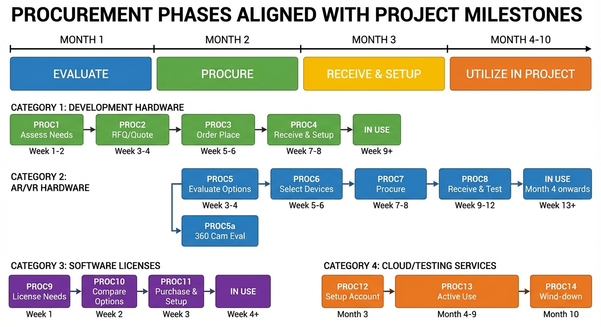
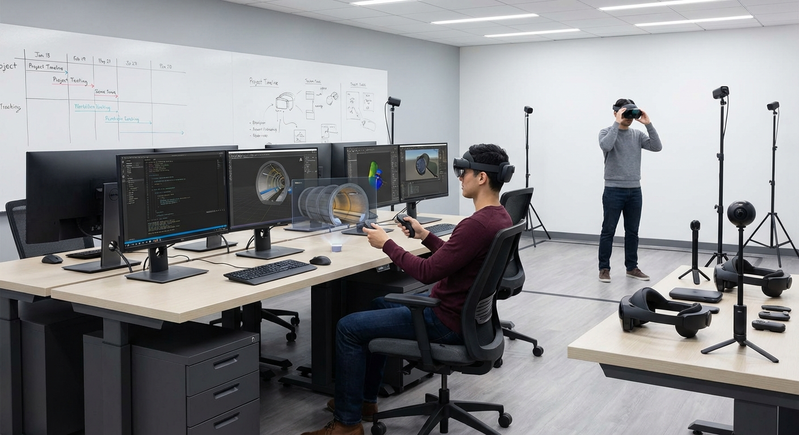
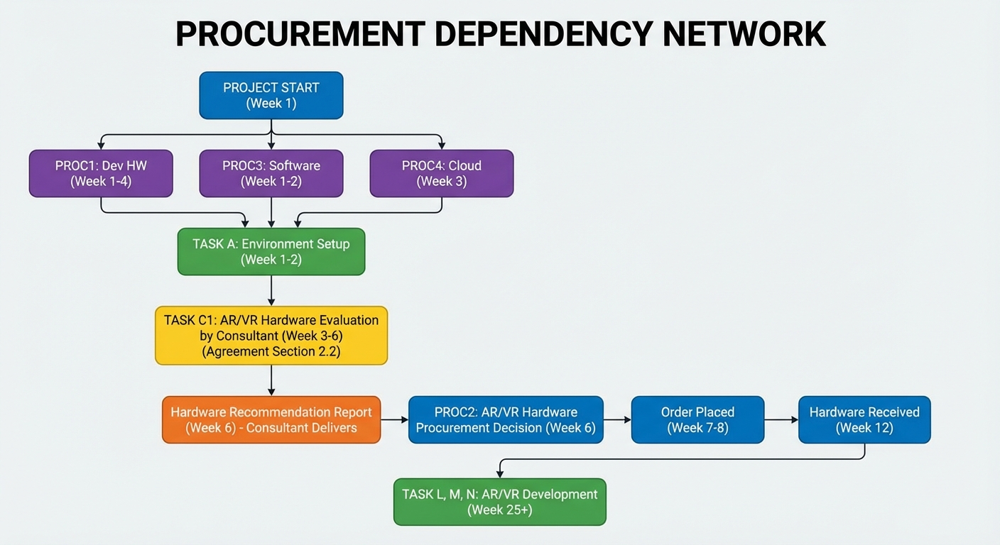
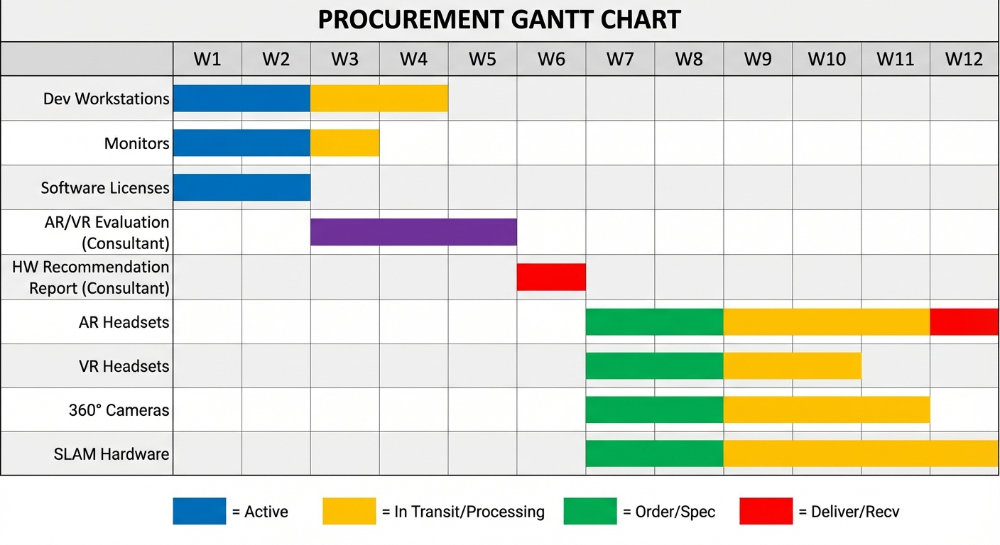
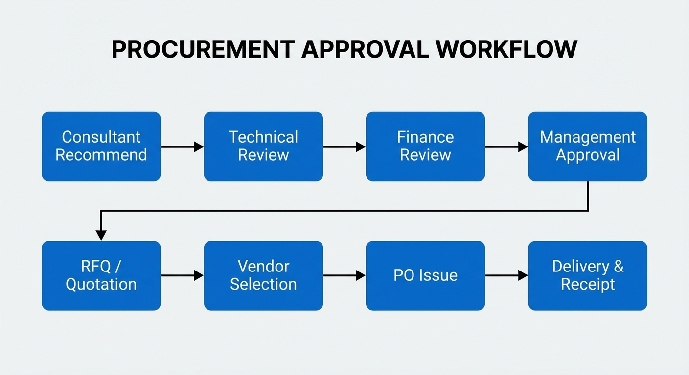

# Tunnel Management System (TMS) MMI/UI Development
## Procurement & Resource Plan

**Project Duration:** 10 Months (01 Jan 2026 - 31 Oct 2026)
**Procurement Lead Time:** 4-8 weeks typical
**Budget Authority:** VaaaN Infra Private Limited
**Asset Ownership:** All procured items are VaaaN property (Agreement Section 8.3)

**Scope:** MMI/UI Module only (visualization layer consuming Platform Software APIs)
**Out of Scope:** Platform Software, Rule Engine, Database (provided by VaaaN)

---

## Contractual Reference

This procurement plan aligns with the **Technical Consultancy Agreement**:

| Consultant Responsibility | Agreement Section | Deliverable |
|--------------------------|-------------------|-------------|
| Identify AR/VR hardware | 2.2 | Hardware Recommendation Report |
| Identify 360° cameras | 2.2 | Camera Selection Report |
| Identify SLAM hardware | 2.2 | SLAM/Localization Specs |
| Setup PM environment | 2.3 | GitHub Projects configured |
| Hardware recommendations in good faith | 9 | Technical merit-based selection |

| VaaaN Responsibility | Agreement Section | Required By |
|---------------------|-------------------|-------------|
| Engineering drawings (BIM/CAD/Navisworks) | 9 | Week 2 |
| System-level APIs | 9 | Week 1 |
| Traffic Management Plan (TMP) | 2.5 | Week 35 |
| Maintenance Manual | 2.5 | Week 35 |
| Budget approval for procurement | — | As needed |

---

## Procurement Timeline Overview

---

## Category 1: Development Hardware

### Workstations & Displays

| Proc ID | Item | Qty | Est. Cost (INR) | Lead Time | Required By | Project Task |
|---------|------|-----|-----------------|-----------|-------------|--------------|
| **PROC1.1** | High-Performance Workstation | 2 | 2,50,000 each | 2-3 weeks | Week 4 | Task A |
| | - CPU: Intel i9/AMD Ryzen 9 | | | | | |
| | - GPU: NVIDIA RTX 4080/4090 | | | | | |
| | - RAM: 64GB DDR5 | | | | | |
| | - Storage: 2TB NVMe SSD | | | | | |
| **PROC1.2** | Development Monitors | 4 | 50,000 each | 1-2 weeks | Week 4 | Task A |
| | - 32" 4K IPS Display | | | | | |
| **PROC1.3** | Video Wall Simulator | 1 | 1,50,000 | 2-3 weeks | Week 8 | Task E |
| | - Multi-monitor setup (4x displays) | | | | | |

### Infrastructure

| Proc ID | Item | Qty | Est. Cost (INR) | Lead Time | Required By | Project Task |
|---------|------|-----|-----------------|-----------|-------------|--------------|
| **PROC1.4** | Network Equipment | 1 set | 50,000 | 1 week | Week 4 | Task A |
| | - Managed Switch, Router | | | | | |
| **PROC1.5** | UPS Systems | 2 | 25,000 each | 1 week | Week 4 | Task A |
| | - 2KVA Online UPS | | | | | |

**Subtotal Category 1: ~INR 12,00,000**

---

## Category 2: AR/VR Hardware

*Per Agreement Section 2.2: Consultant identifies suitable devices*

### AR Headsets

| Proc ID | Item | Qty | Est. Cost (INR) | Lead Time | Required By | Project Task |
|---------|------|-----|-----------------|-----------|-------------|--------------|
| **PROC2.1** | AR Headset (Primary) | 2 | 3,50,000 each | 4-6 weeks | Week 12 | Task L |
| | **Options under Consultant evaluation:** | | | | | |
| | - Microsoft HoloLens 2 | | | | | |
| | - Magic Leap 2 | | | | | |
| | - Vuzix M400 (Rugged) | | | | | |

### VR Headsets

| Proc ID | Item | Qty | Est. Cost (INR) | Lead Time | Required By | Project Task |
|---------|------|-----|-----------------|-----------|-------------|--------------|
| **PROC2.2** | VR Headset | 2 | 1,50,000 each | 2-3 weeks | Week 12 | Task M |
| | **Options under Consultant evaluation:** | | | | | |
| | - Meta Quest Pro | | | | | |
| | - HTC Vive Pro 2 | | | | | |
| | - Varjo XR-3 (High-end) | | | | | |

### 360° Cameras - For Google Street View Style Navigation

*Per Agreement Section 2.1: "Importing 360° camera view in 3D visualization mode"*

**Purpose:** Capture 360° panoramas at regular intervals to enable "Street View" style navigation where operators can look in any direction (up/down/left/right) and move between capture positions.

**Decision Matrix:**

| If LiDAR Choice Is... | 360° Camera Decision | User Experience |
|-----------------------|---------------------|-----------------|
| Any LiDAR (no Street View needed) | Not required | 3D point cloud navigation |
| Any LiDAR + Street View required | **Required** | Street View + 3D hybrid |
| Leica BLK360 G2 (combo device) | Built-in | Integrated Street View + LiDAR |

| Proc ID | Item | Qty | Est. Cost (INR) | Lead Time | Required By | Project Task |
|---------|------|-----|-----------------|-----------|-------------|--------------|
| **PROC2.3a** | **Professional 360° Camera (RECOMMENDED)** | | | | | |
| | - **Insta360 Pro 2** (8K, 6-lens, HDR) | 1 | 4,50,000 | 3-4 weeks | Week 12 | Task L1 |
| | - Insta360 Titan (11K, premium) | 1 | 12,00,000 | 4-6 weeks | | Alternative |
| **PROC2.3b** | **Budget 360° Camera** | | | | | |
| | - Ricoh Theta Z1 (7K, compact) | 2 | 80,000 each | 2 weeks | Week 12 | Task L1 |
| | - Insta360 X4 (8K, consumer) | 2 | 50,000 each | 1-2 weeks | | Alternative |
| **PROC2.3c** | **Combo Device (LiDAR + 360°)** | | | | | |
| | - Leica BLK360 G2 (replaces PROC2.4c) | 1 | 15,00,000 | 6-8 weeks | Week 20 | Task N.3 + L1 |
| **PROC2.3d** | **360° Capture Accessories** | 1 set | 50,000 | 2 weeks | Week 12 | Task L1 |
| | - Monopod/tripod with leveling | | 15,000 | | | |
| | - Extra batteries | | 20,000 | | | |
| | - Carrying case | | 10,000 | | | |
| | - Memory cards (512GB × 2) | | 5,000 | | | |

**Consultant Recommendation:**

| Priority | Choice | Total Cost | Notes |
|----------|--------|------------|-------|
| **Budget** | Ricoh Theta Z1 × 2 | 1,60,000 | Good quality, easy to use |
| **Balanced** | **Insta360 Pro 2** | **4,50,000** | **Professional grade, recommended** |
| **Integrated** | Leica BLK360 G2 | 15,00,000 | LiDAR + 360° in one device |

**Capture Specifications:**

| Parameter | Requirement |
|-----------|-------------|
| Resolution | Minimum 6K (6144×3072), prefer 8K |
| HDR | Required for tunnel lighting conditions |
| Capture spacing | Every 5-10m along tunnel |
| Positions per km | 100-150 capture points |
| Output format | Equirectangular JPEG/PNG |

### SLAM & Positioning Infrastructure

*Per Agreement Section 2.2: "SLAM algorithms needed for accurate positioning"*

**Challenge:** Tunnel environments lack distinctive visual features for HoloLens built-in tracking. A hybrid UWB + Visual Marker infrastructure is required for reliable AR positioning.

**Reference:** See `docs/SLAM-Infrastructure-Specification.md` for detailed technical specifications.

| Proc ID | Item | Qty | Est. Cost (INR) | Lead Time | Required By | Project Task |
|---------|------|-----|-----------------|-----------|-------------|--------------|
| **PROC2.4a** | **UWB Anchor System** | — | **4,50,000** | 4-6 weeks | Week 26 | Task N.1 |
| | - UWB Anchors (ceiling/wall mount) | 1 per 40m | 15,000 each | | | |
| | - UWB Tags (for HoloLens/tablets) | 4 | 25,000 each | | | |
| | - UWB Gateway/Controller | 1 | 75,000 | | | |
| | - Mounting hardware & cabling | 1 set | 50,000 | | | |
| | **Options under Consultant evaluation:** | | | | | |
| | - Decawave/Qorvo DWM3000 | | | | | |
| | - Pozyx Enterprise | | | | | |
| | - Sewio RTLS | | | | | |
| **PROC2.4b** | **Visual Marker System** | — | **75,000** | 2-3 weeks | Week 26 | Task N.2 |
| | - ArUco/AprilTag printed markers (A3 size) | 1 per 25m + equipment | 500 each | | | |
| | - Retroreflective marker material | 1 roll | 25,000 | | | |
| | - Protective lamination/frames | As needed | 25,000 | | | |
| | - Mounting adhesive/brackets | 1 set | 10,000 | | | |
| **PROC2.4c** | **LiDAR Mapping System (Purchase)** | — | **28,00,000** | 6-8 weeks | Week 20 | Task N.3 |
| | **Scanner (select one):** | | | | | |
| | - Leica BLK2GO (handheld, fast) | 1 | 25,00,000 | | | |
| | - Faro Focus S 150 (tripod, high accuracy) | 1 | 24,00,000 | | | |
| | - Leica RTC360 (tripod, HDR camera) | 1 | 38,00,000 | | | |
| | **Registration Targets:** | | | | | |
| | - Survey spheres (6") | 10 | 1,50,000 | | | |
| | - Checkerboard targets | 20 | 1,00,000 | | | |
| | **Registration Software:** | | | | | |
| | - Autodesk ReCap Pro (annual) | 1 | 50,000/yr | | | |
| | - OR Leica Cyclone REGISTER 360 | 1 | 4,00,000 | | | |
| | - OR Faro SCENE | 1 | 3,00,000 | | | |
| | **Note:** Cost shown assumes Leica BLK2GO + ReCap Pro | | | | | |
| **PROC2.4d** | **Calibration & Test Equipment** | 1 set | **50,000** | 1-2 weeks | Week 28 | Task N.5 |
| | - Laser distance meter | 1 | 15,000 | | | |
| | - Total station rental (calibration) | 2 days | 25,000 | | | |
| | - Reference point markers | 20 | 10,000 | | | |

**Subtotal PROC2.4 (SLAM Infrastructure): ~INR 33,75,000**

| Component | Cost (INR) |
|-----------|------------|
| UWB Anchor System (PROC2.4a) | 4,50,000 |
| Visual Marker System (PROC2.4b) | 75,000 |
| LiDAR Mapping System (PROC2.4c) | 28,00,000 |
| Calibration Equipment (PROC2.4d) | 50,000 |
| **Total** | **33,75,000** |

**Notes:**
- Quantity of UWB anchors and visual markers depends on tunnel length. Estimates based on 1km tunnel.
- LiDAR system is a capital asset owned by VaaaN, usable for future tunnel projects.
- If 360° cameras (PROC2.3) are eliminated, net increase is ~INR 22,75,000.

### Accessories

| Proc ID | Item | Qty | Est. Cost (INR) | Lead Time | Required By | Project Task |
|---------|------|-----|-----------------|-----------|-------------|--------------|
| **PROC2.5** | AR/VR Development Accessories | 1 set | 1,00,000 | 2 weeks | Week 10 | Task L |
| | - Controllers, trackers | | | | | |
| | - Charging stations | | | | | |
| | - Protective cases | | | | | |

**Subtotal Category 2: ~INR 52,00,000**

| Component | Cost (INR) | Notes |
|-----------|------------|-------|
| AR Headsets (PROC2.1) | 7,00,000 | 2× HoloLens 2 |
| VR Headsets (PROC2.2) | 3,00,000 | 2× Meta Quest Pro |
| 360° Cameras (PROC2.3) | 0 - 4,00,000 | **OPTIONAL** if LiDAR has HDR |
| SLAM Infrastructure (PROC2.4) | 33,75,000 | Includes LiDAR purchase |
| Accessories (PROC2.5) | 1,00,000 | Controllers, chargers |
| **Total (without 360° cams)** | **44,75,000** | |
| **Total (with 360° cams)** | **48,75,000** | |

*(Significant increase due to LiDAR equipment purchase for site team ownership)*

---

## Category 3: Software Licenses

### Game Engine & Development Tools

| Proc ID | Item | Qty/Type | Est. Cost (INR) | Lead Time | Required By | Project Task |
|---------|------|----------|-----------------|-----------|-------------|--------------|
| **PROC3.1** | Unreal Engine | Free | 0 | Immediate | Week 1 | Task A |
| | (Royalty-free for internal use) | | | | | |
| **PROC3.2** | Unity Pro License (if selected) | 2 seats | 1,50,000/yr | 1-2 days | Week 1 | Task A |
| **PROC3.7** | IDE Licenses | 2-3 | 50,000/yr | Immediate | Week 1 | Task A |
| | - JetBrains Rider | | | | | |
| | - Visual Studio Pro | | | | | |

### AI-Assisted Development Tools

| Proc ID | Item | Qty/Type | Est. Cost (INR) | Lead Time | Required By | Project Task |
|---------|------|----------|-----------------|-----------|-------------|--------------|
| **PROC3.11** | Claude Code Max Subscription | 2 seats | 1,70,000/yr | Immediate | Week 1 | All Tasks |
| | - Anthropic Claude Code CLI | | (~$100/mo × 2 × 10 mo) | | | |
| | - AI-assisted coding for developers | | | | | |

### BIM/CAD Software

| Proc ID | Item | Qty/Type | Est. Cost (INR) | Lead Time | Required By | Project Task |
|---------|------|----------|-----------------|-----------|-------------|--------------|
| **PROC3.3** | Autodesk Software Suite | 2 seats | 2,00,000/yr | 1 week | Week 2 | Task D |
| | - Navisworks Manage | | | | | |
| | - AutoCAD | | | | | |
| **PROC3.4** | BIM Software | 1 seat | 1,00,000/yr | 1 week | Week 2 | Task D |
| | - Revit / BIM 360 | | | | | |

### Project Management & Collaboration

*Per Agreement Section 2.3: "Setup a Technical Project Management environment using free tools like Click-up"*

| Proc ID | Item | Qty/Type | Est. Cost (INR) | Lead Time | Required By | Project Task |
|---------|------|----------|-----------------|-----------|-------------|--------------|
| **PROC3.5** | Version Control | Team | 30,000/yr | Immediate | Week 1 | Task A |
| | - GitHub Team / GitLab | | | | | |
| **PROC3.6** | Project Management (GitHub) | Team | Free (with Team) | Immediate | Week 1 | Task A |
| | - GitHub Issues + Projects (Kanban) | | | | | |
| | - Integrated with version control (PROC3.5) | | | | | |

### AR/VR SDK & AI

| Proc ID | Item | Qty/Type | Est. Cost (INR) | Lead Time | Required By | Project Task |
|---------|------|----------|-----------------|-----------|-------------|--------------|
| **PROC3.8** | AR SDK Licenses | As needed | Variable | 1 week | Week 10 | Task L |
| | - Vuforia (if needed) | | | | | |
| | - ARCore/ARKit (Free) | | | | | |
| **PROC3.9** | SLM/LLM API Access (OpenRouter) | 1 account | Pay-as-you-go | Immediate | Week 25 | Task O |
| | - OpenRouter API subscription | | (~50,000 estimated) | | | |
| | - Multi-model access (LLaMA, Mistral, Claude, GPT-5.2, etc.) | | | | | |
| | - Flexibility to switch models as needed | | | | | |

### Database (VaaaN Provided)

| Proc ID | Item | Qty/Type | Est. Cost (INR) | Lead Time | Required By | Project Task |
|---------|------|----------|-----------------|-----------|-------------|--------------|
| **PROC3.10** | Database License | N/A | 0 | N/A | N/A | VaaaN Provides |
| | - MySQL provided by VaaaN | | | | | |
| | - MMI/UI connects via Platform Software APIs | | | | | |

**Subtotal Category 3: ~INR 7,50,000/year** (includes Claude Code Max)

---

## Category 4: Cloud & Testing Services

| Proc ID | Item | Duration | Est. Cost (INR) | Lead Time | Required By | Project Task |
|---------|------|----------|-----------------|-----------|-------------|--------------|
| **PROC4.1** | Cloud Development Environment | 8 months | 1,00,000 | 1 day | Week 3 | Task A |
| | - AWS / Azure (Dev/Test only) | | | | | |
| **PROC4.2** | Testing Automation Tools | Annual | 50,000 | 1 week | Week 9 | Task G |
| | - Selenium, Appium | | | | | |
| **PROC4.3** | Load Testing Services | As needed | 30,000 | On-demand | Week 16 | Task G |
| | - JMeter / LoadRunner | | | | | |
| **PROC4.4** | Security Testing | Once | 1,00,000 | 2 weeks | Week 35 | Task Q |
| | - Penetration testing service | | | | | |

**Subtotal Category 4: ~INR 2,80,000**

---

## VaaaN-Provided Inputs (Not Procurement)

*Per Agreement Section 9: "Company shall provide..."*

| Item | Format | Required By | Status |
|------|--------|-------------|--------|
| Engineering Drawings | BIM (IFC/RVT) | Week 2 | Pending |
| Engineering Drawings | AutoCAD (DWG/DXF) | Week 2 | Pending |
| Engineering Drawings | Navisworks (NWC/NWD) | Week 2 | Pending |
| Platform Software APIs | MQTT Specification | Week 1 | Pending |
| Database Schema | MySQL ERD | Week 1 | Pending |
| **Traffic Management Plan (TMP)** | **PDF** | **Week 35** | **Pending** |
| **Maintenance Manual** | **PDF** | **Week 35** | **Pending** |
| **Operator Training Procedures** | **PDF/Excel** | **Week 35** | **Pending** |

**Note:** TMP and Maintenance Manual are required inputs for the SLM Training Module (Agreement Section 2.5).

---

## Procurement Dependency Network

---

## Vendor Evaluation Matrix

*Per Agreement Section 9: "All hardware recommendations shall be made in good faith based on technical merit"*

### Development Workstations (PROC1.1)

| Vendor | Model | Score (1-10) | Notes |
|--------|-------|--------------|-------|
| Dell | Precision 7875 Tower | 9 | Enterprise support, certified |
| HP | Z8 G5 Workstation | 9 | Strong GPU options |
| Lenovo | ThinkStation P620 | 8 | Good value |
| Custom Build | — | 7 | Cost-effective, no support |

### AR Headsets (PROC2.1)

| Device | Price (INR) | Score | Pros | Cons | Tunnel Suitability |
|--------|-------------|-------|------|------|-------------------|
| Microsoft HoloLens 2 | 3,50,000 | 9 | Best tracking, enterprise features | Expensive | Excellent |
| Magic Leap 2 | 3,00,000 | 8 | Good FOV, dimming | Limited availability | Good |
| Vuzix M400 | 1,50,000 | 7 | Rugged, affordable | Limited features | Good (rugged) |

### VR Headsets (PROC2.2)

| Device | Price (INR) | Score | Pros | Cons | Tunnel Suitability |
|--------|-------------|-------|------|------|-------------------|
| Meta Quest Pro | 1,10,000 | 8 | Standalone + PC, good tracking | Meta ecosystem | Good |
| HTC Vive Pro 2 | 1,50,000 | 8 | High resolution, accurate | Requires base stations | Training room |
| Varjo XR-3 | 4,00,000 | 9 | Best resolution, pass-through | Very expensive | Excellent |

### 360° Cameras (PROC2.3)

| Device | Price (INR) | Score | Pros | Cons | Tunnel Suitability |
|--------|-------------|-------|------|------|-------------------|
| Insta360 Pro 2 | 1,80,000 | 9 | 8K, live streaming | Complex workflow | Excellent |
| Ricoh Theta Z1 | 80,000 | 7 | Compact, easy | Limited resolution | Basic |
| Kandao Obsidian Pro | 2,50,000 | 8 | Professional grade | Expensive | Excellent |

### UWB Positioning Systems (PROC2.4a)

| System | Price/Anchor (INR) | Score | Pros | Cons | Tunnel Suitability |
|--------|-------------------|-------|------|------|-------------------|
| **Decawave/Qorvo DWM3000** | 12,000 | 9 | Industry standard, good SDK, low power | Requires custom integration | Excellent |
| **Pozyx Enterprise** | 18,000 | 8 | Easy setup, good software | Higher cost | Good |
| **Sewio RTLS** | 20,000 | 8 | Enterprise features, analytics | Expensive, complex | Good (large scale) |
| **Ubisense** | 25,000 | 7 | Very accurate | Very expensive | Industrial |

**Recommendation:** Decawave/Qorvo DWM3000 for best price/performance ratio and proven tunnel/industrial deployments.

### Visual Marker Systems (PROC2.4b)

| Marker Type | Cost/Marker | Score | Pros | Cons | Tunnel Suitability |
|-------------|-------------|-------|------|------|-------------------|
| **ArUco (OpenCV)** | ~500 (print) | 9 | Free, well-documented, HoloLens native | Requires good lighting | Good |
| **AprilTag** | ~500 (print) | 9 | Robust detection, good at angles | Slightly slower | Good |
| **Vuforia Markers** | License cost | 7 | Commercial support | License fees | Good |
| **Retroreflective + ArUco** | ~2,000 | 10 | Works in low light | Higher cost | Excellent |

**Recommendation:** ArUco markers with retroreflective backing for tunnel low-light conditions.

### LiDAR Scanners (PROC2.4c)

| Scanner | Type | Price (INR) | Score | Accuracy | Speed | HDR Camera | Tunnel Suitability |
|---------|------|-------------|-------|----------|-------|------------|-------------------|
| **Leica BLK2GO** | Handheld | 25,00,000 | 9 | ±1-2cm | Fast (walk) | Yes (basic) | Excellent - fast capture |
| **Faro Focus S 150** | Tripod | 24,00,000 | 8 | ±1mm | Slow | Optional | Good - high accuracy |
| **Leica RTC360** | Tripod | 38,00,000 | 9 | ±1mm | Medium | Yes (36MP HDR) | Excellent - best of both |
| **GeoSLAM ZEB Horizon** | Handheld | 20,00,000 | 7 | ±1-3cm | Fast | No | Good - budget option |
| **Faro Focus Premium** | Tripod | 32,00,000 | 8 | ±1mm | Slow | Yes (HDR) | Good - premium features |

**Recommendation Options:**

| Priority | Scanner | Rationale | Total PROC2.4c Cost |
|----------|---------|-----------|---------------------|
| **Budget** | GeoSLAM ZEB Horizon + ReCap | Lowest cost, adequate accuracy | ~22,50,000 |
| **Balanced** | Leica BLK2GO + ReCap | Fast capture, good accuracy, built-in camera | ~28,00,000 |
| **Premium** | Leica RTC360 + Cyclone | Best accuracy + HDR camera, eliminates 360° cams | ~42,00,000 |

**Note:** If Leica RTC360 is selected, PROC2.3 (360° cameras) can be eliminated, resulting in net cost similar to balanced option.

### Registration Software (PROC2.4c)

| Software | Price (INR) | Score | Pros | Cons | Recommendation |
|----------|-------------|-------|------|------|----------------|
| **Autodesk ReCap Pro** | 50,000/yr | 8 | UE5 integration, affordable | Subscription | Best for project |
| **Leica Cyclone REGISTER 360** | 4,00,000 | 9 | Best for Leica scanners | Expensive | If using Leica |
| **Faro SCENE** | 3,00,000 | 8 | Best for Faro scanners | Faro-specific | If using Faro |
| **CloudCompare** | Free | 7 | Free, capable | Manual workflow | Backup option |

---

## Procurement Timeline (Gantt View)

---

## Budget Summary

### Capital Expenditure (One-Time)

| Category | Amount (INR) | Ownership |
|----------|--------------|-----------|
| Development Hardware (PROC1) | 12,00,000 | VaaaN |
| AR/VR/SLAM Hardware (PROC2) | 44,75,000 | VaaaN |
| **Total CapEx** | **56,75,000** | **VaaaN** |

**Note:** Per Agreement Section 8.3, all hardware assets are VaaaN property and must be returned upon termination.

**SLAM Infrastructure Breakdown (PROC2.4):**
| Item | Amount (INR) |
|------|--------------|
| UWB Anchor System (PROC2.4a) | 4,50,000 |
| Visual Marker System (PROC2.4b) | 75,000 |
| LiDAR Mapping System (PROC2.4c) | 28,00,000 |
| Calibration Equipment (PROC2.4d) | 50,000 |
| **SLAM Subtotal** | **33,75,000** |

**Strategic Value of LiDAR Purchase:**
- Reusable for future tunnel projects (VaaaN asset)
- Eliminates dependency on rental availability
- Site team can perform surveys on-demand
- Potential to eliminate 360° cameras if scanner has HDR (-4,00,000)

### Operational Expenditure (Recurring/Project Duration)

| Category | Amount (INR) |
|----------|--------------|
| Software Licenses (Annual) | 7,50,000 |
| Cloud Services (8 months) | 1,30,000 |
| Testing Services | 1,50,000 |
| **Total OpEx** | **10,30,000** |

### Consultant Fees (Per Agreement Section 4)

| Item | Amount (INR) |
|------|--------------|
| Monthly Fee | 1,50,000 |
| Duration | 10 months |
| **Total Consultant Cost** | **15,00,000** |

**Payment Terms:** Monthly invoices, payment within 14 days (Agreement Section 9)

### Grand Total Project Budget

| Category | Amount (INR) |
|----------|--------------|
| CapEx | 56,75,000 |
| OpEx | 10,30,000 |
| Consultant | 15,00,000 |
| Contingency (10%) | 8,20,500 |
| **GRAND TOTAL** | **90,25,500** |

**Budget Change Analysis:**

| Item | Original | Current | Change |
|------|----------|---------|--------|
| SLAM (rental) | 3,00,000 | — | — |
| SLAM (purchase) | — | 33,75,000 | +30,75,000 |
| 360° Cameras | 4,00,000 | 0 (if LiDAR HDR) | -4,00,000 |
| **Net Change** | | | **+26,75,000** |

**Justification for LiDAR Purchase:**
1. **Reusability** - Asset for all VaaaN tunnel projects
2. **On-demand surveys** - No rental scheduling constraints
3. **Quality control** - Site team trained on equipment
4. **Dual purpose** - SLAM reference map + virtual walkthrough
5. **Long-term value** - 5-10 year equipment life

---

## Procurement Approval Workflow

### Approval Thresholds

| Amount (INR) | Approval Authority |
|--------------|-------------------|
| < 50,000 | Consultant + Project Lead |
| 50,000 - 2,00,000 | Technical Head |
| 2,00,000 - 10,00,000 | Finance Director |
| > 10,00,000 | CEO / Board |

---

## Procurement Milestones

| Milestone | Target Date | Status | Dependency | Deliverable |
|-----------|-------------|--------|------------|-------------|
| Development Hardware Ordered | Week 2 | Pending | Budget Approval | — |
| Development Hardware Received | Week 4 | Pending | PROC1 | — |
| Software Licenses Activated | Week 2 | Pending | Budget Approval | — |
| **AR/VR Hardware Report** | **Week 6** | **Pending** | **Task C1** | **Consultant Deliverable** |
| AR/VR Hardware Ordered | Week 8 | Pending | PROC2 Report | — |
| AR/VR Hardware Received | Week 12 | Pending | PROC2 Order | — |
| **SLAM Infrastructure Spec** | **Week 22** | **Pending** | **Task N design** | **Consultant Deliverable** |
| **LiDAR Tunnel Survey** | **Week 24** | **Pending** | **VaaaN coordination** | **Point cloud data** |
| **UWB Anchors Ordered** | **Week 22** | **Pending** | **SLAM Spec approved** | — |
| **UWB Anchors Received** | **Week 26** | **Pending** | **PROC2.4a Order** | — |
| **Visual Markers Produced** | **Week 26** | **Pending** | **PROC2.4b Order** | — |
| **SLAM Infrastructure Installed** | **Week 28** | **Pending** | **VaaaN facilities** | **Anchors + Markers in tunnel** |
| **SLAM Validation Complete** | **Week 30** | **Pending** | **Task N.5** | **<30cm accuracy verified** |
| All Procurement Complete | Week 30 | Pending | All PROC tasks | — |

---

## Risk Mitigation for Procurement

| Risk | Mitigation Strategy | Agreement Reference |
|------|---------------------|---------------------|
| Hardware delivery delays | Order 4 weeks before needed; identify backup vendors | — |
| Import duties/customs | Budget 20% extra for international orders; use local vendors where possible | — |
| Technology obsolescence | Lease options for high-cost items; ensure upgrade paths | — |
| Vendor lock-in | Prefer open standards; evaluate alternatives | Section 2.1 (open-source) |
| Budget overrun | 10% contingency; phased procurement | — |
| Software license compliance | Centralized license management; audit trail | — |
| **AR/VR hardware doesn't meet tunnel requirements** | **Consultant evaluation includes tunnel-specific testing** | **Section 2.2** |
| **SLAM accuracy insufficient in tunnel environment** | **Multiple algorithm evaluation; fallback options** | **Section 2.2** |

---

## Recommended Procurement Sequence

### Immediate (Week 1-2)
1. Software licenses (Unreal/Unity, Autodesk, IDE)
2. Development workstations (Order)
3. Project management (GitHub Projects setup)
4. Version control setup

### Early Phase (Week 3-8)
1. Receive development hardware
2. Cloud services setup
3. **AR/VR hardware evaluation by Consultant** (parallel with project work)
4. Network equipment

### Mid Phase (Week 9-12)
1. AR headsets (order Week 7, receive Week 12)
2. VR headsets (order Week 7, receive Week 10)
3. 360° cameras (order Week 7, receive Week 11)
4. SLAM hardware (order Week 7, receive Week 12)
5. Video wall simulator

### Late Phase (Week 25+)
1. SLM/LLM licenses (if needed)
2. Testing tools
3. Security testing services

---

## Vendor Contact Points

| Category | Recommended Vendors (India) |
|----------|----------------------------|
| Workstations | Dell India, HP India, Lenovo India |
| AR Devices | Microsoft India, Distributor partners |
| VR Devices | Meta authorized resellers, HTC India |
| 360 Cameras | Amazon Business, Insta360 India |
| Software | Official websites, authorized resellers |
| Cloud Services | AWS India, Azure India |

---

## Consultant Deliverables Related to Procurement

*Per Agreement Section 2.2 & 2.4*

| Deliverable | Due | Description |
|-------------|-----|-------------|
| **Hardware Recommendation Report** | Week 6 | Complete evaluation of AR/VR devices, 360° cameras |
| **Device Selection Report** | Week 6 | Scored matrix with final recommendations |
| **SLAM/Localization Specifications** | Week 6 | Algorithm selection and hardware requirements |
| **Integration Package** | Week 36 | All hardware integrated into TMS ecosystem |

---

## Asset Handover Requirements

*Per Agreement Section 8.3*

Upon project completion or termination:

1. All procured hardware remains VaaaN property
2. Consultant returns all materials, data, documents, hardware, and software assets
3. Source code and documentation handed over
4. No retention of copies by Consultant

**Asset Register:** VaaaN maintains asset register of all procured items with serial numbers, locations, and assigned users.
