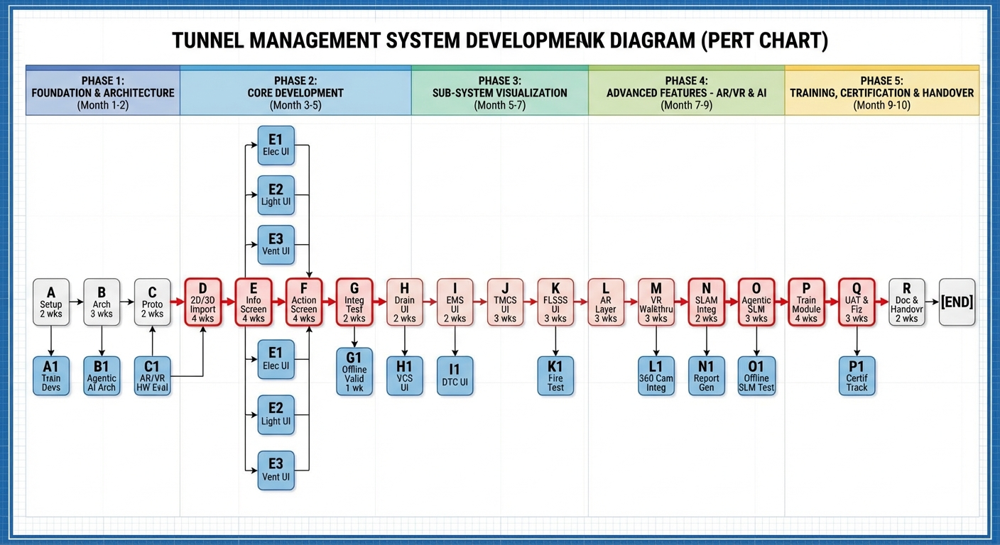

# Tunnel Management System (TMS) MMI/UI Development
## Technical Consultancy Project Plan

**Project Duration:** 10 Months (01 Jan 2026 - 31 Oct 2026)
**Engagement Model:** Technical Consultancy (Independent Contractor)
**Team:** 1 Consultant + 2 Company Developers
**Site Visits:** Minimum 1 per week (documented)

**Scope:** Agentic AI-based MMI/UI Module (Digital Twin visualization layer consuming Platform Software APIs)
**Out of Scope:** Platform Software, Rule Engine, Database setup (provided by VaaaN)

---

## Contractual Reference

This plan aligns with the **Technical Consultancy Agreement** between VaaaN Infra Private Limited and the Consultant. Key contractual obligations tracked:

| Obligation | Section | Tracking Mechanism |
|------------|---------|-------------------|
| Weekly site visits | 2.0 | Weekly Visit Log (Deliverable) |
| Developer mentoring | 2.3 | GitHub Issues task assignments |
| Source code handover | 8.3 | Final Handover (Task R) |
| Offline deployment | 1.0 | Offline Validation Gate (Task G1) |
| Agentic AI approach | 1.0, 2.1 | Architecture Design (Task B) |

---

## Project Network Diagram


---

## Work Breakdown Structure

### PHASE 1: PROJECT FOUNDATION (Weeks 1-8)

#### A. Project Setup & Environment (2 weeks)

| Task ID | Deliverable | Duration | Dependencies | Owner | Acceptance Criteria |
|---------|-------------|----------|--------------|-------|---------------------|
| A.1 | PM Environment (GitHub Projects) | 3 days | — | Consultant | Issues + Kanban board configured, developers onboarded |
| A.2 | Dev Environment (Unreal/Unity) | 4 days | — | All | Build compiles successfully |
| A.3 | Version Control Repository | 2 days | A.2 | Dev 1 | Git repo with branching strategy |
| A.4 | Platform Software API Connectivity | 1 day | A.2 | Dev 2 | MQTT publish/subscribe verified |
| **A.5** | **VaaaN Input Validation** | **2 days** | A.2 | Consultant | **BIM/CAD/Navisworks files received & validated** |
| A.6 | Claude Code Max Setup | 1 day | A.2 | All | AI-assisted development tools configured for both developers |

**Weekly Visit Log:** Consultant maintains documented record of all site visits (Agreement Section 2.0).

---

#### A1. Developer Training & Mentoring (2 weeks)

| Task ID | Deliverable | Duration | Dependencies | Owner | Acceptance Criteria |
|---------|-------------|----------|--------------|-------|---------------------|
| A1.1 | Unreal/Unity Fundamentals Training | 5 days | A | Consultant | Developers can create basic scenes |
| A1.2 | BIM/CAD Import Techniques | 3 days | A1.1 | Consultant | Developers can import sample files |
| A1.3 | API Integration Patterns | 2 days | A1.2 | Consultant | Developers understand MQTT patterns |

---

#### B. MMI/UI Architecture Design (3 weeks)

| Task ID | Deliverable | Duration | Dependencies | Owner | Acceptance Criteria |
|---------|-------------|----------|--------------|-------|---------------------|
| B.1 | Requirements Traceability Matrix | 3 days | A | All | All URS/SyRS requirements mapped |
| B.2 | MMI/UI Component Architecture | 4 days | B.1 | Consultant | Component hierarchy defined |
| B.3 | Platform Software Integration Spec | 3 days | B.2 | Consultant | API contracts documented |
| B.4 | Architecture Review & Approval | 2 days | B.3 | All | VaaaN sign-off |
| **B.5** | **Agentic AI Architecture Design** | **2 days** | B.2 | Consultant | **Agent orchestration layer defined** |

---

#### B1. Agentic AI Framework Design (1 week)

*Per Agreement Section 1.0 & 2.1: "Agentic AI based MMI/UI based on Digital Twin philosophy"*

| Task ID | Deliverable | Duration | Dependencies | Owner | Acceptance Criteria |
|---------|-------------|----------|--------------|-------|---------------------|
| B1.1 | AI Agent Behavior Specification | 2 days | B.2 | Consultant | Agent types & responsibilities defined |
| B1.2 | Digital Twin Data Flow Design | 2 days | B1.1 | Consultant | Real-time sync architecture documented |
| B1.3 | Autonomous Monitoring Patterns | 1 day | B1.2 | Consultant | Alert escalation logic defined |

---

#### C. Prototype Development (2 weeks)

| Task ID | Deliverable | Duration | Dependencies | Owner | Acceptance Criteria |
|---------|-------------|----------|--------------|-------|---------------------|
| C.1 | Base Unreal/Unity Project | 3 days | B | Dev 1 | Project template created |
| C.2 | UI Framework Implementation | 4 days | C.1 | All | Reusable UI components |
| C.3 | Basic Navigation System | 3 days | C.2 | Dev 2 | 2D/3D navigation working |
| C.4 | Prototype Review | 2 days | C.3 | All | Stakeholder approval |

---

#### C1. AR/VR Hardware Evaluation (2 weeks)

*Per Agreement Section 2.2: Consultant identifies suitable hardware*

| Task ID | Deliverable | Duration | Dependencies | Owner | Acceptance Criteria |
|---------|-------------|----------|--------------|-------|---------------------|
| C1.1 | AR Device Market Analysis | 3 days | B | Consultant | Shortlist with scoring matrix |
| C1.2 | VR Device Market Analysis | 3 days | B | Consultant | Shortlist with scoring matrix |
| C1.3 | 360° Camera Evaluation | 2 days | B | Consultant | Camera recommendations |
| C1.4 | SLAM Solution Assessment | 3 days | C1.3 | Consultant | Algorithm comparison report |
| **C1.5** | **Hardware Recommendation Report** | **3 days** | C1.4 | Consultant | **Complete procurement trigger document** |

---

#### D. 2D/3D Import Module (4 weeks)

| Task ID | Deliverable | Duration | Dependencies | Owner | Acceptance Criteria |
|---------|-------------|----------|--------------|-------|---------------------|
| D.1 | BIM File Parser | 5 days | C | Dev 1 | IFC/RVT files import correctly |
| D.2 | AutoCAD DWG/DXF Importer | 5 days | C | Dev 2 | CAD files render accurately |
| D.3 | Navisworks Integration | 4 days | D.1 | Dev 1 | NWC/NWD files supported |
| D.4 | Synthetic Map Generator | 4 days | D.2, D.3 | All | Auto-generate maps from drawings |
| D.5 | Overlay/Underlay System | 3 days | D.4 | Dev 2 | Layer management working |
| D.6 | Module Integration Test | 3 days | D.5 | All | All import paths verified |

---

### PHASE 2: CORE UI DEVELOPMENT (Weeks 9-18)

#### E. Information Screen Development (4 weeks)

*Per Agreement Section 2.1: "handling entire tunnel"*

| Task ID | Deliverable | Duration | Dependencies | Owner | Acceptance Criteria |
|---------|-------------|----------|--------------|-------|---------------------|
| E.1 | Tunnel Overview Screen | 5 days | D | Dev 1 | Full tunnel visualization |
| E.2 | Schematic Safety Layout | 4 days | E.1 | Dev 2 | All safety systems shown |
| E.3 | Real-time Status Dashboard | 5 days | E.2 | All | Live data from Platform Software |
| E.4 | Alarm Banner System | 3 days | E.3 | Dev 1 | Notifications display correctly |
| E.5 | MQTT Integration Layer | 3 days | E.4 | All | All subscriptions active |

---

#### E1-E3. Sub-system Visualization Overlays (6 weeks parallel)

| Task ID | Deliverable | Duration | Dependencies | Owner |
|---------|-------------|----------|--------------|-------|
| E1.1-E1.3 | Electrical Distribution UI | 2 weeks | E.1 | Dev 2 |
| E2.1-E2.3 | Lighting System UI | 2 weeks | E.1 | Dev 1 |
| E3.1-E3.3 | Ventilation System UI | 2 weeks | E.2 | All |

---

#### F. Action Screen Development (4 weeks)

*Per Agreement Section 2.1: "auto-tile itself as per number of ongoing incidents"*

| Task ID | Deliverable | Duration | Dependencies | Owner | Acceptance Criteria |
|---------|-------------|----------|--------------|-------|---------------------|
| F.1 | Auto-Tile Layout Engine | 5 days | D | Consultant + Dev 1 | Dynamic tiling for 1-8 incidents |
| F.2 | Incident Card Component | 4 days | F.1 | Dev 2 | Card displays all incident data |
| F.3 | PTZ Camera Control | 4 days | F.2 | Dev 1 | Camera control integrated |
| F.4 | Incident Confirmation Workflow | 3 days | F.3 | All | Operator can confirm/dismiss |
| F.5 | Operator Action Logger | 2 days | F.4 | Dev 2 | All actions timestamped |
| F.6 | Incident Closure Form | 2 days | F.5 | Dev 1 | Closure with reason capture |

---

#### G. Phase 2 Integration Testing (2 weeks)

| Task ID | Deliverable | Duration | Dependencies | Owner | Acceptance Criteria |
|---------|-------------|----------|--------------|-------|---------------------|
| G.1 | Component Unit Tests | 4 days | E, F | All | >80% code coverage |
| G.2 | Integration Test Suite | 4 days | G.1 | All | All interfaces verified |
| G.3 | Performance Benchmarks | 2 days | G.2 | Consultant | Latency < 500ms |

---

#### G1. Offline Operation Validation Gate (1 week)

*Per Agreement Section 1.0: "deployed in an offline manner"*

| Task ID | Deliverable | Duration | Dependencies | Owner | Acceptance Criteria |
|---------|-------------|----------|--------------|-------|---------------------|
| **G1.1** | **Network Isolation Test** | **2 days** | G.2 | All | **System functions with no internet** |
| **G1.2** | **Local Data Persistence Test** | **2 days** | G1.1 | Dev 2 | **All data stored locally** |
| **G1.3** | **Offline Validation Report** | **1 day** | G1.2 | Consultant | **Signed-off offline compliance** |

---

### PHASE 3: SUB-SYSTEM UIs (Weeks 19-26)

#### H. Drainage System UI (2 weeks)

| Task ID | Deliverable | Duration | Dependencies | Owner |
|---------|-------------|----------|--------------|-------|
| H.1 | Sump Level Visualization | 3 days | G1 | Dev 2 |
| H.2 | Pump Status & Control | 3 days | H.1 | Dev 2 |
| H.3 | Hydrocarbon Monitoring | 2 days | H.2 | Dev 2 |
| H.4 | Flood Warning Integration | 2 days | H.3 | Dev 2 |

#### H1. Voice Communication System UI (1 week)

| Task ID | Deliverable | Duration | Dependencies | Owner |
|---------|-------------|----------|--------------|-------|
| H1.1 | ECB Status Display | 2 days | H.1 | Dev 1 |
| H1.2 | Radio/PA System Status | 2 days | H1.1 | Dev 1 |
| H1.3 | GSM Coverage Display | 1 day | H1.2 | Dev 1 |

---

#### I. Environment Monitoring System UI (2 weeks)

| Task ID | Deliverable | Duration | Dependencies | Owner |
|---------|-------------|----------|--------------|-------|
| I.1 | CO/NOx Monitoring Graphs | 3 days | H | Dev 1 |
| I.2 | Visibility Monitoring | 2 days | I.1 | Dev 1 |
| I.3 | Anemometer Display | 2 days | I.2 | Dev 1 |
| I.4 | Temperature Monitoring | 2 days | I.3 | Dev 1 |

#### I1. Data Transmission System UI (1 week)

| Task ID | Deliverable | Duration | Dependencies | Owner |
|---------|-------------|----------|--------------|-------|
| I1.1 | Network Topology Visualization | 3 days | I.1 | Dev 2 |
| I1.2 | SNMP Status Integration | 2 days | I1.1 | Dev 2 |

---

#### J. Traffic Management Control System UI (3 weeks)

| Task ID | Deliverable | Duration | Dependencies | Owner |
|---------|-------------|----------|--------------|-------|
| J.1 | CCTV Grid Display | 3 days | I | Dev 1 |
| J.2 | VAID Integration | 4 days | J.1 | Dev 2 |
| J.3 | LCS/DMS Control Interface | 3 days | J.2 | Dev 1 |
| J.4 | Traffic Signal Control | 2 days | J.3 | Dev 2 |
| J.5 | Over-height Detection Alert | 2 days | J.4 | Dev 1 |
| J.6 | Traffic Detection Display | 2 days | J.5 | Dev 2 |

---

#### K. Fire & Life Safety System UI (3 weeks)

| Task ID | Deliverable | Duration | Dependencies | Owner |
|---------|-------------|----------|--------------|-------|
| K.1 | Access Control System UI | 3 days | J | Dev 2 |
| K.2 | Fire Alarm Panel Integration | 4 days | K.1 | Dev 1 |
| K.3 | Fire Fighting Systems Control | 4 days | K.2 | All |
| K.4 | Clean Agent System UI | 2 days | K.3 | Dev 2 |
| K.5 | Emergency Exit Visualization | 2 days | K.4 | Dev 1 |

#### K1. Fire Scenario Simulation Testing (2 weeks)

| Task ID | Deliverable | Duration | Dependencies | Owner |
|---------|-------------|----------|--------------|-------|
| K1.1 | Positive Alarm Sequence Test | 3 days | K.2 | All |
| K1.2 | Double Knock Test | 3 days | K1.1 | All |
| K1.3 | Full Fire Incident Simulation | 4 days | K1.2 | All |

---

### PHASE 4: ADVANCED FEATURES (Weeks 27-36)

#### L. AR Layer Development (3 weeks)

*Per Agreement Section 2.2: "AR visual layers over real-world tunnel environments"*

| Task ID | Deliverable | Duration | Dependencies | Owner | Acceptance Criteria |
|---------|-------------|----------|--------------|-------|---------------------|
| L.1 | AR SDK Integration | 4 days | K | Dev 1 | SDK connected to project |
| L.2 | Equipment Overlay System | 5 days | L.1 | All | AR markers on equipment |
| L.3 | Real-time Data AR Display | 4 days | L.2 | Dev 2 | Live values shown in AR |
| L.4 | AR Navigation Markers | 2 days | L.3 | Dev 1 | Wayfinding in tunnel |

#### L1. 360° Camera Integration (2 weeks)

*Per Agreement Section 2.1: "Importing 360° camera view"*

| Task ID | Deliverable | Duration | Dependencies | Owner |
|---------|-------------|----------|--------------|-------|
| L1.1 | 360° Feed Capture Module | 4 days | L.1 | Dev 2 |
| L1.2 | Panoramic View Integration | 3 days | L1.1 | Dev 2 |
| L1.3 | Street View-like Walkthrough | 3 days | L1.2 | Dev 2 |

---

#### M. VR Walkthrough Module (3 weeks)

*Per Agreement Section 2.2: "Camera VR walkthrough modes"*

| Task ID | Deliverable | Duration | Dependencies | Owner |
|---------|-------------|----------|--------------|-------|
| M.1 | VR Environment Setup | 4 days | L | Dev 1 |
| M.2 | 3D Tunnel Model Integration | 5 days | M.1 | All |
| M.3 | Interactive Equipment Points | 4 days | M.2 | Dev 2 |
| M.4 | VR Navigation System | 2 days | M.3 | Dev 1 |

---

#### N. SLAM Integration & Positioning Infrastructure (4 weeks)

*Per Agreement Section 2.2: "SLAM algorithms needed for accurate positioning"*

**Challenge:** Tunnel environments lack distinctive visual features, causing HoloLens built-in tracking to drift. A hybrid positioning infrastructure is required.

**Reference:** See `docs/SLAM-Infrastructure-Specification.md` for detailed technical specifications.

| Task ID | Deliverable | Duration | Dependencies | Owner | Acceptance Criteria |
|---------|-------------|----------|--------------|-------|---------------------|
| **N.1** | **UWB Infrastructure Planning** | **3 days** | M | Consultant | Beacon placement map, coverage analysis |
| N.1.1 | Tunnel survey for UWB placement | 2 days | N.1 | Dev 1 | All mounting points identified |
| N.1.2 | UWB anchor installation coordination | 1 day | N.1.1 | Consultant | Installation schedule with VaaaN |
| **N.2** | **Visual Marker System Design** | **3 days** | N.1 | Consultant | Marker IDs, placement strategy documented |
| N.2.1 | ArUco/AprilTag marker generation | 1 day | N.2 | Dev 2 | Unique markers for all locations |
| N.2.2 | Marker placement & installation | 2 days | N.2.1 | Dev 1 | Markers installed per specification |
| **N.3** | **Pre-built Tunnel Map Creation (Site Team LiDAR)** | **8 days** | N.1 | All | 3D reference map from LiDAR scan |
| N.3.1 | Site team LiDAR training | 2 days | PROC2.4c | Consultant | Team certified on scanner operation |
| N.3.2 | Scan planning & target placement | 1 day | N.3.1 | VaaaN Site Team | Sphere targets placed, control points noted |
| N.3.3 | Tunnel LiDAR capture | 2 days | N.3.2 | VaaaN Site Team | Raw scans acquired (both bores if applicable) |
| N.3.4 | Scan registration & QC | 2 days | N.3.3 | VaaaN Site Team + Dev 2 | Unified point cloud, <5mm registration error |
| N.3.5 | Map processing & UE5 export | 1 day | N.3.4 | Dev 2 | Optimized mesh/point cloud for real-time use |

**Site Team LiDAR Workflow (Task N.3):**

```
PHASE 1: PREPARATION (N.3.2)
├── Survey control points (tie to tunnel chainage system)
├── Place sphere targets every 20-30m in overlapping positions
├── Document target IDs and approximate chainages
└── Verify scanner battery, storage capacity

PHASE 2: CAPTURE (N.3.3)
├── For Handheld (BLK2GO): Walk at steady 3-4 km/h pace
│   ├── Complete full tunnel length
│   ├── Pause 2-3 seconds at each target for better registration
│   └── Complete return loop for closure optimization
├── For Tripod (RTC360/Faro): Setup every 10-15m
│   ├── Ensure 30%+ overlap between scan positions
│   ├── Include minimum 3 targets per scan
│   └── ~3-5 min per scan position
└── Estimated time: 1 day per km (handheld) or 2 days per km (tripod)

PHASE 3: REGISTRATION (N.3.4)
├── Import all scans to registration software (ReCap Pro/Cyclone)
├── Auto-detect sphere targets
├── Run cloud-to-cloud refinement (ICP algorithm)
├── Apply surveyed control points (georeferencing)
├── QC: Check registration error per target (<5mm for tripod, <15mm for handheld)
└── Export unified point cloud (E57/LAS format)

PHASE 4: PROCESSING (N.3.5)
├── Decimate point cloud for real-time use (target: 5-10M points)
├── Generate mesh if needed (for collision/occlusion)
├── Apply colorization from scanner camera (if available)
├── Export to UE5 format (via ReCap → FBX/OBJ)
└── Verify import in UE5 project
```

**Deliverables from Site Team:**
| Deliverable | Format | Size (approx) |
|-------------|--------|---------------|
| Raw scan data | Scanner native | 50-100 GB |
| Registered point cloud | E57/LAS | 5-10 GB |
| Decimated point cloud | E57/LAS | 500 MB - 1 GB |
| Colored point cloud (if HDR camera) | E57/LAS | 1-2 GB |
| Registration report | PDF | 5 MB |

| Task ID | Deliverable | Duration | Dependencies | Owner | Acceptance Criteria |
|---------|-------------|----------|--------------|-------|---------------------|
| **N.4** | **Sensor Fusion Algorithm** | **5 days** | N.2, N.3 | Consultant + Dev 1 | HoloLens + UWB fusion working |
| N.4.1 | UWB SDK integration | 2 days | N.4 | Dev 1 | UWB position data in UE5 |
| N.4.2 | Visual marker detection | 2 days | N.4 | Dev 2 | ArUco detection in HoloLens app |
| N.4.3 | Kalman filter implementation | 1 day | N.4.1, N.4.2 | Consultant | Fused position output |
| **N.5** | **Accuracy Validation & Calibration** | **5 days** | N.4 | All | Position accuracy < 30cm achieved |
| N.5.1 | Static accuracy testing | 2 days | N.5 | Dev 1 | Accuracy at known points measured |
| N.5.2 | Dynamic tracking testing | 2 days | N.5.1 | Dev 2 | Accuracy during movement measured |
| N.5.3 | Calibration refinement | 1 day | N.5.2 | Consultant | Final calibration parameters set |

**Acceptance Gate:** Position accuracy < 30cm in 95% of tunnel coverage area.

#### N1. Report Generation Module (2 weeks)

| Task ID | Deliverable | Duration | Dependencies | Owner |
|---------|-------------|----------|--------------|-------|
| N1.1 | Report Template Engine | 4 days | N.1 | Dev 2 |
| N1.2 | MIS Report Types | 3 days | N1.1 | Dev 2 |
| N1.3 | PDF/Excel Export | 3 days | N1.2 | Dev 2 |

---

#### O. Agentic SLM Interface (3 weeks)

*Per Agreement Section 2.1: "Chat-GPT like voice/text interface using... Open-Source Small Language Model"*

| Task ID | Deliverable | Duration | Dependencies | Owner | Acceptance Criteria |
|---------|-------------|----------|--------------|-------|---------------------|
| O.1 | SLM Selection & Offline Setup | 4 days | N | Consultant | Model runs without internet |
| O.2 | Document Ingestion (TMP, Manuals) | 4 days | O.1 | Dev 1 | PDF/Excel parsing working |
| O.3 | Query Processing Engine | 5 days | O.2 | Consultant + Dev 2 | Natural language queries work |
| O.4 | Voice Interface Integration | 3 days | O.3 | Dev 2 | Speech-to-text operational |
| O.5 | Response Formatting | 2 days | O.4 | Dev 1 | Clean formatted answers |

#### O1. Offline SLM Validation (1 week)

| Task ID | Deliverable | Duration | Dependencies | Owner | Acceptance Criteria |
|---------|-------------|----------|--------------|-------|---------------------|
| **O1.1** | **Offline Query Test** | **2 days** | O.3 | All | **100% queries work offline** |
| **O1.2** | **Prediction Feasibility Report** | **2 days** | O1.1 | Consultant | **Document prediction capabilities** |
| **O1.3** | **SLM Performance Benchmark** | **1 day** | O1.2 | Consultant | **Response time < 3 seconds** |

---

### PHASE 5: TRAINING, CERTIFICATION & HANDOVER (Weeks 37-43)

#### P. Training Module Development (4 weeks)

*Per Agreement Section 2.5: "training modules within the software for familiarizing operators"*

| Task ID | Deliverable | Duration | Dependencies | Owner | Acceptance Criteria |
|---------|-------------|----------|--------------|-------|---------------------|
| P.1 | Training Content from TMP/Manuals | 4 days | O | Consultant | All procedures documented |
| P.2 | Interactive Tutorial System | 5 days | P.1 | Dev 1 | Guided walkthroughs working |
| P.3 | Scenario-based Training | 4 days | P.2 | All | 10+ training scenarios |
| **P.4** | **Self-Training Chat Interface** | **5 days** | P.3 | Dev 2 | **SLM answers operator questions** |
| **P.5** | **UX Validation for Operators** | **2 days** | P.4 | Consultant | **Control room UX tested** |

---

#### P1. Operator Assessment & Certification Module (2 weeks)

*Per Agreement Section 2.5: "create operator assessment modules... certification readiness"*

| Task ID | Deliverable | Duration | Dependencies | Owner | Acceptance Criteria |
|---------|-------------|----------|--------------|-------|---------------------|
| P1.1 | Assessment Framework | 3 days | P.2 | Consultant | Competency criteria defined |
| P1.2 | Scenario-based Tests | 4 days | P1.1 | Dev 1 | Test bank created |
| P1.3 | Performance Metrics Tracking | 3 days | P1.2 | Dev 2 | Scores stored & retrievable |
| **P1.4** | **Certification Status Tracking** | **2 days** | P1.3 | Dev 2 | **Certification readiness dashboard** |
| **P1.5** | **Learning Progress Reports** | **2 days** | P1.4 | Dev 2 | **Individual progress exportable** |

---

#### Q. User Acceptance Testing & Fixes (3 weeks)

| Task ID | Deliverable | Duration | Dependencies | Owner | Acceptance Criteria |
|---------|-------------|----------|--------------|-------|---------------------|
| Q.1 | UAT Test Plan | 2 days | P, P1 | Consultant | All scenarios documented |
| Q.2 | User Acceptance Testing | 8 days | Q.1 | All | VaaaN stakeholder sign-off |
| Q.3 | Bug Fixes & Refinements | 5 days | Q.2 | All | All critical bugs resolved |

---

#### R. Documentation & Handover (2 weeks)

*Per Agreement Section 2.4 & 8.3: Complete handover of all deliverables*

| Task ID | Deliverable | Duration | Dependencies | Owner | Acceptance Criteria |
|---------|-------------|----------|--------------|-------|---------------------|
| R.1 | API Documentation | 3 days | Q | Consultant | All APIs documented |
| R.2 | Integration Manual | 3 days | R.1 | Consultant | Step-by-step integration guide |
| R.3 | Maintenance Guide | 2 days | R.2 | Consultant | Troubleshooting procedures |
| **R.4** | **Source Code Handover** | **1 day** | R.3 | All | **All code transferred to VaaaN** |
| R.5 | Developer Competency Verification | 2 days | R.4 | Consultant | Developers can maintain code |
| R.6 | Final Handover Sign-off | 1 day | R.5 | All | **Project Complete** |

---

## VaaaN Input Dependencies

*Per Agreement Section 9: "Company shall provide..."*

| Input Required | Format | Required By | Acceptance Criteria |
|----------------|--------|-------------|---------------------|
| Engineering Drawings | BIM (IFC/RVT) | Week 2 | Files open in Revit/Navisworks |
| Engineering Drawings | AutoCAD (DWG/DXF) | Week 2 | Files open in AutoCAD |
| Engineering Drawings | Navisworks (NWC/NWD) | Week 2 | Files open in Navisworks |
| Platform Software APIs | MQTT Specification | Week 1 | API contract documented |
| Database Schema | MySQL ERD | Week 1 | Schema documentation provided |
| **Traffic Management Plan (TMP)** | **PDF** | **Week 35** | **Document for SLM training** |
| **Maintenance Manual** | **PDF** | **Week 35** | **Document for SLM training** |
| **Operator Training Procedures** | **PDF/Excel** | **Week 35** | **Certification criteria source** |

---

## Critical Path Analysis

**Critical Path:** A → B → C → D → E → F → G → G1 → H → I → J → K → L → M → N → O → O1 → P → Q → R

**Total Duration:** 43 weeks (10 months)

**Critical Deliverables (Zero Float):**
1. **Architecture Design (B)** — Foundation for all development
2. **Agentic AI Framework (B1)** — Contractual requirement
3. **2D/3D Import Module (D)** — Enables all visualization
4. **Information & Action Screens (E, F)** — Core operator interface
5. **Offline Validation Gate (G1)** — Contractual compliance checkpoint
6. **AR/VR Integration (L, M)** — Key differentiating features
7. **SLAM & Positioning Infrastructure (N)** — Critical for AR accuracy in tunnel
8. **Agentic SLM Interface (O)** — Key innovation
9. **Offline SLM Validation (O1)** — Contractual compliance checkpoint
10. **Certification Tracking (P1.4)** — Contractual deliverable

**Note:** Task N (SLAM Integration) expanded from 2 weeks to 4 weeks to accommodate tunnel-specific positioning infrastructure (UWB beacons, visual markers, sensor fusion). This is absorbed within the existing Phase 4 timeline by parallelizing with Task O preparation.

---

## Risk Register

| Risk ID | Risk Description | Probability | Impact | Mitigation | Agreement Reference |
|---------|-----------------|-------------|--------|------------|---------------------|
| R1 | BIM/CAD file format variations | High | Medium | Build flexible parsers, test with sample files early | Section 9 |
| R2 | AR/VR hardware delivery delays | Medium | High | Order hardware by end of Month 2 | Section 2.2 |
| R3 | Platform Software API changes | Medium | High | Regular sync with VaaaN team, API versioning | Section 2.1 |
| R4 | Developer skill gaps | Medium | Medium | Extended training period, pair programming | Section 2.3 |
| R5 | Platform Software/Rule Engine delays | Medium | High | Early integration testing, mock APIs if needed | Section 9 |
| R6 | SLAM algorithm accuracy in tunnels | High | Medium | Multiple algorithm evaluation, fallback options | Section 2.2 |
| R7 | SLM performance on offline systems | Medium | Medium | Lightweight model selection, performance testing | Section 1 |
| **R8** | **VaaaN fails to provide BIM/CAD files on time** | **Medium** | **High** | **Explicit acceptance criteria, escalation path** | **Section 9** |
| **R9** | **SLM cannot run offline acceptably** | **Medium** | **High** | **Evaluate multiple models, fallback to rule-based** | **Section 1** |
| **R10** | **Operator certification criteria undefined** | **Medium** | **Medium** | **Early clarification with VaaaN HR/Operations** | **Section 2.5** |
| **R11** | **TMP/Maintenance Manual not provided** | **Medium** | **Medium** | **Request by Week 30, escalate if not received** | **Section 2.5** |
| **R12** | **UWB beacon installation access denied** | **Medium** | **High** | **Early coordination with VaaaN facilities; backup visual-only positioning** | **Section 2.2** |
| **R13** | **HoloLens tracking drift exceeds tolerance** | **High** | **Medium** | **Hybrid UWB+visual system; increased marker density in problem areas** | **Section 2.2** |
| **R14** | **Tunnel environmental interference (RF, lighting)** | **Medium** | **Medium** | **Site survey before hardware selection; shielded UWB anchors if needed** | **Section 2.2** |
| **R15** | **Visual markers damaged/obscured in tunnel** | **Medium** | **Low** | **Durable marker materials; redundant marker coverage; UWB as primary** | **Section 2.2** |

---

## Monthly Milestone Summary

| Month | Key Milestones | Deliverables | Contractual Checkpoint |
|-------|---------------|--------------|------------------------|
| **Month 1** | Project Kickoff, Environment Ready | GitHub Projects, Dev Environment, Repository | Weekly visit log initiated |
| **Month 2** | Architecture Complete, Prototype Ready | Architecture Doc, UI Framework, **Hardware Report** | Agentic AI architecture defined |
| **Month 3** | 2D/3D Import Working | BIM/CAD/Navisworks Importers | — |
| **Month 4** | Information Screen Complete | Overview, Schematic, Dashboard UIs | — |
| **Month 5** | Action Screen Complete, **Offline Validated** | Incident Management UI, **Offline Validation Report** | Offline compliance verified |
| **Month 6** | Sub-system UIs (Electrical, Lighting, Ventilation) | All monitoring UIs | — |
| **Month 7** | Sub-system UIs (Drainage, EMS, TMCS, FLSSS) | All visualization overlays | — |
| **Month 8** | AR/VR Development, **SLAM Infrastructure** | AR Overlays, VR Walkthrough, **UWB Beacons Installed, Visual Markers Placed** | SLAM infrastructure operational |
| **Month 9** | **SLAM Validation** & Agentic SLM Interface | **Position Accuracy Validated (<30cm)**, SLAM Integration, **Offline SLM Validated** | SLM offline compliance verified |
| **Month 10** | Training, **Certification Module** & Handover | Training Module, **Certification Tracker**, Documentation, **Source Code Handover** | All deliverables transferred |

---

## Consultant Resource Allocation

| Phase | Weeks | Hours/Week | Focus Areas |
|-------|-------|------------|-------------|
| Foundation | 1-8 | 20 | Architecture, Training, Hardware Eval, Agentic AI Design |
| Core Development | 9-18 | 16 | UI Review, Integration Design, Offline Validation |
| Sub-system UIs | 19-26 | 12 | Code Review, Overlay Development |
| Advanced Features | 27-36 | 20 | AR/VR, SLAM, Agentic SLM Interface |
| Finalization | 37-43 | 16 | Training, Certification Module, Documentation, Handover |

---

## Developer Focus Areas

### Developer 1
- Unreal/Unity Development Lead
- 2D/3D Visualization
- TMCS UI
- AR Integration
- Training Module
- VR Navigation

### Developer 2
- Backend Integration
- Sub-system UIs (Electrical, Drainage, FLSSS)
- Report Generation
- Assessment & Certification Module
- Voice Interface
- 360° Camera Integration
